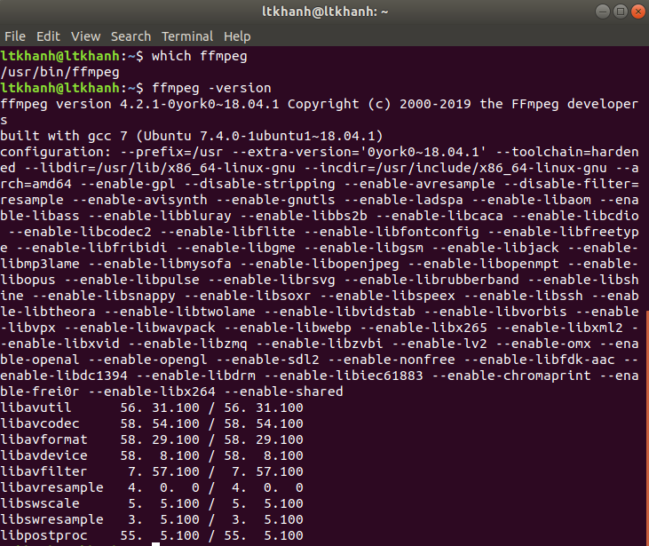

# Node-streaming-app
node streaming server and UI for user who want to live stream using OBS and RMTP server

## Getting Started
Building a livestream server and make a simple website to display livestream video using RMTP and OBS. We do 5 feature in this project:
- Web Server with Basic authentication
- Setting up an RTMP server in Nodejs
- Displaying live streams
- Issuing streaming keys to broadcasters
- Generating live stream thumbnails

## Installing
### For Linux
- Package ffmpeg must be install. You can check this package with this command:
```
$ which ffmpeg
$ which -version
```


- If you don't have ffmpeg installed, you can install by using this command:
```
$ sudo add-apt-repository ppa:jonathonf/ffmpeg-4
$ sudo apt install ffmpeg
```

### For window
- If you don't have ffmpeg installed, you can download it on this website:
https://ffmpeg.zeranoe.com/builds/

## Running and tests
```
$ npm install

# run webpack and watch for changes
$ npm run watch 

# run node server with supervisor and watch for changes
$ npm run start
```